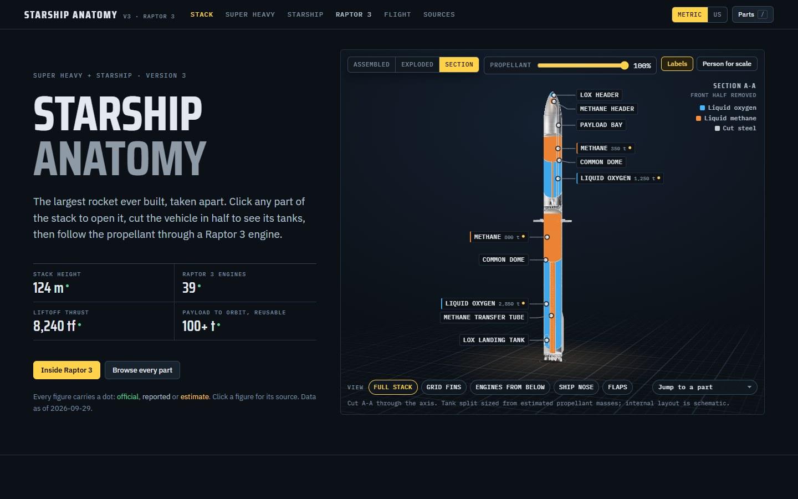
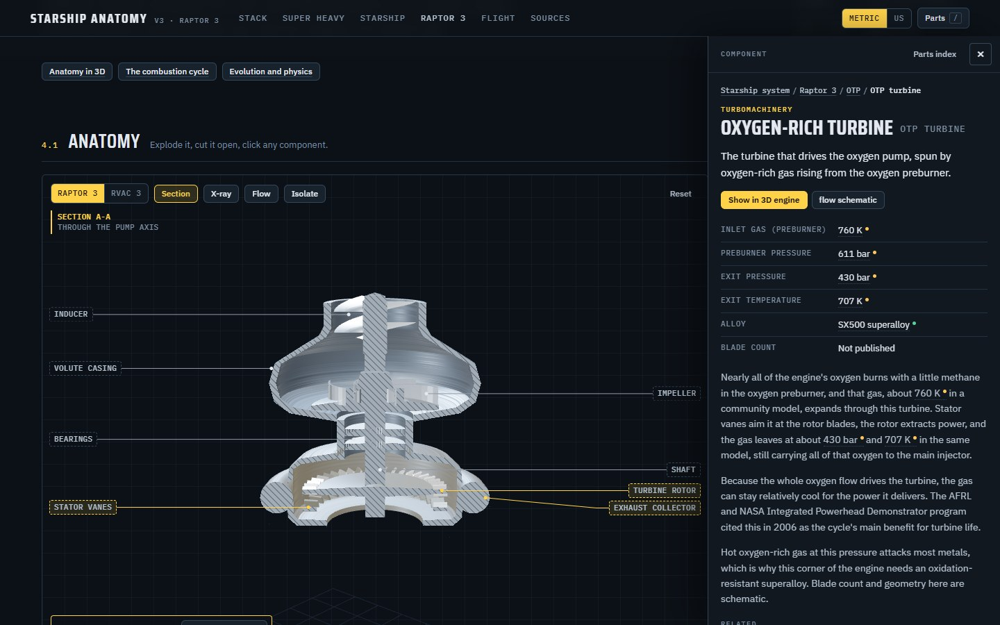
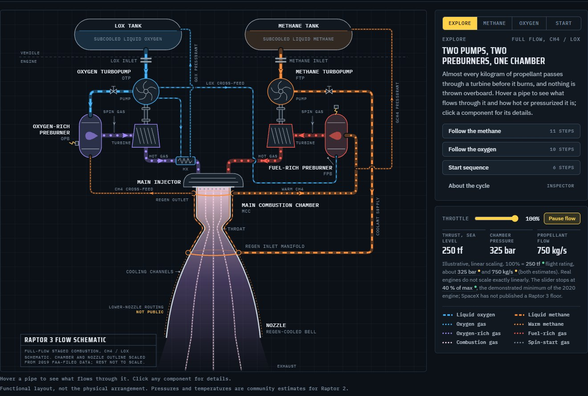

# Starship Anatomy

An interactive, sourced teardown of SpaceX's Starship V3: the Super Heavy booster, the Starship upper stage, and above all the Raptor 3 engine. Click any part of the vehicle to open it up, cut it in half, and follow the propellant through the engine.

**Live site: https://starship.dallaswx.com**



## What's inside

- **3D stack.** A procedural model of the full V3 stack at its published proportions. Explode it, or cut it in half to see the tanks, the methane transfer tube, the landing tank and the header tanks, with a slider for how full the tanks are.
- **Super Heavy and Starship cutaways.** Engineering-style drawings where every part is clickable, plus a 33-engine map with engine-out and gimbal demos, a heat-shield tile explorer and a reentry and landing sequence.
- **Raptor 3 in depth.**
  - A 3D engine you can explode, section, x-ray and run animated propellant flows through. Selecting a turbopump or the main chamber cuts that part open with its inner pieces labeled.
  - An animated full-flow staged combustion schematic with a throttle and guided tours of the methane path, the oxygen path and the start sequence, plus a comparison with the cycles behind Merlin, RD-180, RS-25 and RL10.
  - Raptor 1, 2 and 3 side by side, a nozzle and plume lab that follows the flame from sea level to vacuum, and a rocket equation playground.
- **Flight.** A mission player driven by the Flight 14 plan, a tower catch sequence, a size comparison with other rockets, and a log of every integrated flight test.
- **Click anything.** 110 components open in an inspector showing where they sit in the vehicle, sourced specs, and the parts inside them. Press `/` to search every part. A Metric/US toggle converts every figure.





## Accuracy

Every figure on the page carries a confidence level (official, reported, estimate or disputed); click any number to see its source. The canonical data lives in [`research/facts.json`](research/facts.json): 174 facts from 58 sources, backed by five research dossiers and a fact-check log in [`research/`](research/). Data is current to 2026-09-29, the day after Flight 14.

SpaceX publishes a few headline numbers and keeps most engine internals private. Where the page relies on public analysis (turbopump layout, station pressures and temperatures inside Raptor) it labels those figures as estimates and says so in the text.

## Run it

- **Online:** open `index.html` in a browser. It loads three.js r147 from jsDelivr and fonts from Google Fonts, so it needs an internet connection. No server is required.
- **Offline, one file:** `python tools/bundle.py` writes `dist/Starship Anatomy.html` with every script inlined, including three.js. Only the web fonts are left out; offline, the page uses system fonts.

## Project layout

```
index.html        page shell, design tokens and shared component styles
js/core.js        shared runtime: parts registry, inspector, facts and units, 3D stage helper
js/<view>.js      one file per view: stack3d, booster, ship, raptor3d, raptorcycle, raptorlab, flight
js/data.js        generated from research/facts.json (do not edit by hand)
research/         sourced dossiers, facts.json and the fact-check log
tools/            build_data.py, bundle.py, shoot.py (headless check and screenshots, needs Playwright)
CONTRACT.md       rules every view module follows: part ids, facts, design system, verification
```

To change a number, edit `research/facts.json` and run `python tools/build_data.py`.

## Disclaimer

An independent educational project, not affiliated with or endorsed by SpaceX. Diagrams are schematic; proportions follow published dimensions where they exist.
